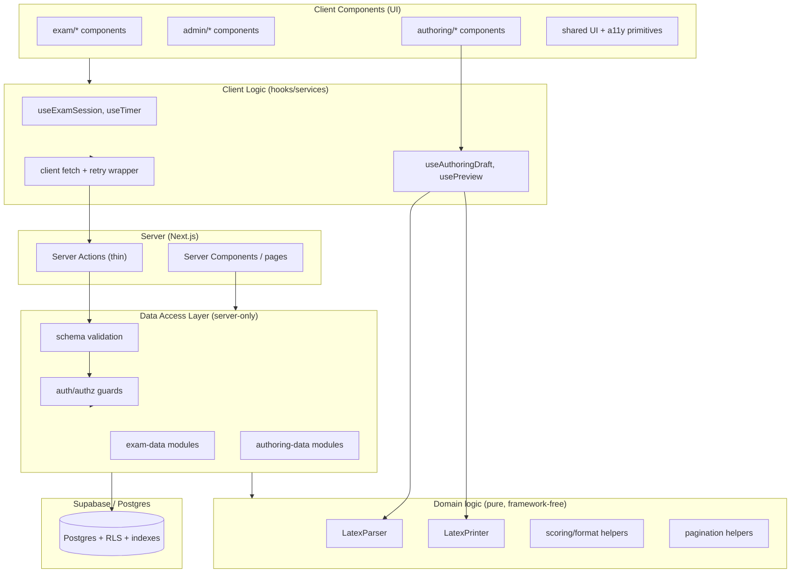

# Design Document

## Overview

Tài liệu thiết kế này mô tả cách thực hiện việc **cải thiện toàn diện** ứng dụng Web-thi-thpt theo 7 nhóm yêu cầu trong `requirements.md`. Mục tiêu kỹ thuật gồm năm nhóm: (1) tái cấu trúc các MergedFile vượt 400 LOC theo hướng tách lớp/OOP có bảo toàn hành vi, (2) làm vững chắc phân hệ soạn đề LaTeX với một `LatexPrinter` chính thức và thuộc tính khứ hồi (round-trip), (3) tối ưu cơ sở dữ liệu Supabase (index, phân trang, chống N+1, RLS), (4) nâng hiệu năng và khả năng tiếp cận frontend (code-split, accessible name, focus indicator, loading/error/retry state), và (5) củng cố độ tin cậy/bảo mật backend (xác thực, phân quyền, validate schema, lỗi có cấu trúc). Đồng thời thiết lập một `ArchitectureChecklist` để định hướng mở rộng tương lai.

Thiết kế tuân thủ ràng buộc cốt lõi: **mọi tái cấu trúc phải bảo toàn hành vi (Behavior_Preserving)** trừ khi một thay đổi hành vi được nêu rõ là yêu cầu, và **mọi thay đổi đặc thù Next.js phải tuân theo tài liệu cục bộ** trong `node_modules/next/dist/docs/`.

### Bối cảnh kỹ thuật đã khảo sát

- **Next.js 16.2.7 (bản tùy biến, App Router)** — đã xác nhận các điểm khác biệt quan trọng từ docs cục bộ:
  - Lazy loading qua `next/dynamic`; `ssr: false` chỉ dùng được trong Client Component (theo `02-guides/lazy-loading.md`).
  - Error boundary dùng prop **`unstable_retry`** (không phải `reset`), và có `unstable_catchError` từ `next/error` cho error boundary ở mức component (theo `01-getting-started/10-error-handling.md`).
  - Khuyến nghị **Data Access Layer (DAL)** chạy `server-only`, trả về DTO tối thiểu; Server Action phải tự xác thực lại vì là entry-point độc lập (theo `02-guides/data-security.md`).
  - Điều hướng nhanh cần `unstable_instant` (ghi nhận, ngoài phạm vi spec này).
- **Supabase**: `@supabase/ssr` cho server/proxy client; truy cập DB qua Supabase client (parameterized theo mặc định). RLS và index tối ưu hóa theo bộ skill `supabase-postgres-best-practices`.
- **Phân hệ Authoring**: `parser.ts` đã có; **chưa có `LatexPrinter`** — đây là thành phần cần xây mới để đạt yêu cầu round-trip (2.4, 2.5, 7.2).
- **Kiểm thử**: Vitest (`vitest run`). Hiện chưa có thư viện property-based; thiết kế chọn `fast-check` cho các property test.

### MergedFiles đã xác định (vượt 400 LOC)

| File | LOC | Domain | Trách nhiệm bị trộn |
|------|-----|--------|---------------------|
| `src/app/admin/page.tsx` | 796 | frontend + backend | UI dashboard + mapping dữ liệu + xử lý lỗi + server actions inline |
| `src/app/admin/authoring/AuthoringWorkspace.tsx` | 767 | frontend + authoring | UI editor + state + preview + gọi action |
| `src/app/exam/page.tsx` | 704 | frontend | UI làm bài + timer + đọc/ghi đáp án + điều hướng |
| `src/app/result/page.tsx` | 559 | frontend | UI kết quả + tính điểm + mapping |
| `src/lib/supabase/exam-data.ts` | 505 | database | nhiều truy vấn + mapping record→DTO trộn chung |
| `src/app/profile/page.tsx` | 501 | frontend | UI hồ sơ + lịch sử + form |
| `src/lib/authoring/parser.ts` | 499 | authoring | tokenize + parse + cập nhật metadata + serialize attr |
| `src/app/admin/authoring/actions.ts` | 426 | backend | nhiều server action + validate + mapping + publish |

## Architecture

### Sơ đồ phân lớp mục tiêu



### Nguyên tắc kiến trúc

1. **Tách UI khỏi nghiệp vụ (Req 1.3)**: Module render (`.tsx` component) không chứa quy tắc nghiệp vụ; nghiệp vụ chuyển vào hooks (client) hoặc DAL/domain (server). Mapping record→DTO rút khỏi component vào DAL.
2. **Một trách nhiệm cho mỗi Module, ≤ 400 LOC (Req 1.1, 1.2)**: Mỗi MergedFile tách thành nhiều Module, mỗi Module phơi bày đúng một primary responsibility.
3. **DAL là cổng duy nhất tới dữ liệu (Req 1.6, 5.1, 5.8)**: Không component UI truy cập trực tiếp dữ liệu đề thi; mọi truy cập qua DAL `server-only`. DAL thực hiện auth/authz + validate + truy vấn tham số hóa.
4. **Domain logic thuần (Req 2, 7.2)**: `LatexParser`/`LatexPrinter`/scoring/pagination là hàm thuần, không phụ thuộc Next.js/Supabase — dễ property-test.
5. **Tái sử dụng logic trùng lặp (Req 1.7)**: Các helper lặp (ví dụ `firstRelation`, `one`, mapping ngày tháng, getActionError) gom vào module dùng chung.
6. **Tuân thủ Next.js cục bộ (Req 7.5)**: Lazy loading, error boundary (`unstable_retry`), DAL pattern theo đúng docs cục bộ.

### Cấu trúc thư mục mục tiêu (Req 6.2)

```
src/
  app/                      # Next.js routes: page.tsx/layout/loading/error chỉ điều phối
    exam/        (+ loading.tsx, error.tsx, _components/)
    result/      (+ loading.tsx, error.tsx, _components/)
    profile/     (+ _components/)
    admin/       (+ _components/, authoring/_components/)
  components/               # UI dùng chung + a11y primitives (frontend domain)
  hooks/                    # client logic tách khỏi render (frontend domain)
  lib/
    authoring/              # LaTeX authoring domain (parser, printer, types, templates)
    data/                   # Data Access Layer (database domain, server-only)
    domain/                 # pure logic dùng chung (scoring, pagination, format)
    server/                 # backend cross-cutting: auth guards, validation, errors
    supabase/               # client/server/proxy factories + env
  store/                    # client state (Zustand)
docs/
  architecture-checklist.md # ArchitectureChecklist (Req 6)
```

Ánh xạ domain → directory: code architecture → `lib/domain` + cấu trúc tổng thể; LaTeX authoring → `lib/authoring`; database → `lib/data` + `lib/supabase`; frontend → `app/**/_components` + `components` + `hooks`; backend → `lib/server` + `app/**/actions.ts`.

## Components and Interfaces

### 1. Lớp Authoring (LaTeX)

Tách `parser.ts` (499 LOC) thành các module theo trách nhiệm và bổ sung `printer.ts` mới:

```
lib/authoring/
  tokenizer.ts     # extractEnvironments, readBalanced, parseAttributes, extractMacro, extractImages
  parser.ts        # parseAuthoringSource, parseQuestion (orchestration parse)
  printer.ts       # NEW: printAuthoringQuestion(s) -> LaTeX
  metadata.ts      # get/updateQuestionMetadataAtPosition
  attributes.ts    # serializeAttributes, formatAttributeValue (dùng chung parse + print)
  types.ts         # types hiện có
  templates.ts     # templates hiện có
```

`LatexPrinter` interface:

```ts
// lib/authoring/printer.ts
export interface PrintOptions {
  mode: AuthoringMode;
}
/** In một cấu trúc câu hỏi nội bộ trở lại LaTeX. Hàm thuần. */
export function printAuthoringQuestion(question: AuthoringQuestion): string;
export function printAuthoringSource(
  result: Pick<AuthoringParseResult, 'mode' | 'questions'>,
): string;
```

`LatexParser` giữ chữ ký công khai hiện có để bảo toàn hành vi:

```ts
export function parseAuthoringSource(source: string, mode: AuthoringMode): AuthoringParseResult;
```

Bổ sung ràng buộc kích thước (Req 2.1, 2.2):

```ts
export const MAX_LATEX_LENGTH = 1_000_000;
// parseAuthoringSource trả về errors=[{message: 'LATEX_EMPTY'|'LATEX_TOO_LARGE', ...}]
// khi source rỗng (sau trim) hoặc length > MAX_LATEX_LENGTH, và KHÔNG tạo questions.
```

> Lưu ý round-trip (Req 2.5): yêu cầu bảo toàn "từng ký tự" gồm khoảng trắng và chú thích. Parser hiện tại `cleanContent` (chuẩn hóa khoảng trắng) — đây là lossy. Thiết kế chọn **chuẩn hóa hai phía (normalize-then-compare)**: round-trip được định nghĩa là `parse(print(parse(x))) ≡ parse(x)` theo cấu trúc câu hỏi đã chuẩn hóa (mọi trường nội dung, định dạng, khoảng trắng đã chuẩn hóa, chú thích trùng khớp). Đây là diễn giải khả thi của 2.5 và khớp 7.2 ("equal to the original input after normalization"). Property test sẽ kiểm chứng tính bất biến cấu trúc qua round-trip thay vì bằng nhau từng byte của chuỗi nguồn thô.

### 2. Lớp Authoring UI

Tách `AuthoringWorkspace.tsx` (767 LOC):

```
app/admin/authoring/
  AuthoringWorkspace.tsx        # orchestration layout (≤400 LOC)
  _components/
    DocumentList.tsx
    EditorPanel.tsx
    PreviewPanel.tsx
    MetadataControls.tsx
  LatexEditor.tsx               # giữ nguyên
hooks/
  useAuthoringDraft.ts          # state nháp + autosave (debounce, gọi action)
  useLatexPreview.ts            # parse + render preview ≤1s, giữ preview hợp lệ gần nhất (Req 2.6, 2.7)
```

`useLatexPreview` hợp đồng:

```ts
type PreviewState = {
  lastValid: AuthoringParseResult | null;
  errors: AuthoringParseError[];   // có line/column
  isStale: boolean;
};
function useLatexPreview(source: string, mode: AuthoringMode, debounceMs?: number): PreviewState;
```

### 3. Lớp Data Access (DAL)

Tách `exam-data.ts` (505 LOC) thành module theo thực thể; mapping tách khỏi truy vấn:

```
lib/data/
  rooms.ts          # fetchPublishedRooms, fetchExamRoomById, fetchSubjectWithRooms
  subjects.ts       # fetchSubjectsWithRoomCounts
  sessions.ts       # fetchExamSessionData, saveSessionAnswer
  mappers.ts        # record -> DTO (one(), mapRoom, mapQuestion, ...)
  format.ts         # formatPriceVnd, difficultyLabel, questionTypeLabel (pure -> lib/domain)
  pagination.ts     # parsePageParams, applyRange (Req 3.2, 3.3)
```

Pagination hợp đồng (Req 3.2, 3.3):

```ts
export const DEFAULT_PAGE_SIZE = 20;
export const MIN_PAGE_SIZE = 1;
export const MAX_PAGE_SIZE = 100;

export type PageParams = { page: number; pageSize: number };
export type PageResult<T> = { items: T[]; page: number; pageSize: number; total: number };

/** Trả về lỗi nếu pageSize ngoài [1,100]; không truy vấn bản ghi nào khi lỗi. */
export function normalizePageParams(
  input: { page?: number; pageSize?: number },
): { ok: true; value: PageParams } | { ok: false; error: 'INVALID_PAGE_SIZE' };
```

Mọi danh sách có thể tăng không giới hạn (rooms theo subject, students, exam history, knowledge fields) dùng `normalizePageParams` + `.range()` của Supabase, và join/`in()` để giữ ≤ 2 truy vấn (Req 3.4).

### 4. Lớp Backend (Server Actions + guards)

Tách `actions.ts` (426 LOC) thành action mỏng + guard/validation dùng chung:

```
lib/server/
  auth-guard.ts     # requireAuth(), requireAdmin() -> trả về kết quả có cấu trúc
  validation.ts     # validate(schema, input) -> {ok, value} | {ok:false, fieldErrors}
  action-result.ts  # type ActionResult<T>, ok()/fail(), sanitizeError()
  logger.ts         # ghi log lỗi server-side (không lộ ra client)
app/admin/authoring/
  actions.ts            # các action mỏng, ủy quyền cho lib/data + lib/server
  _validation.ts        # schema cho từng action
```

`ActionResult` chuẩn hóa (Req 5.2, 5.3, 5.5, 5.6, 5.7):

```ts
export type FieldError = { field: string; message: string };
export type ActionResult<T> =
  | { ok: true; data: T }
  | { ok: false; kind: 'auth' | 'forbidden' | 'validation' | 'error'; message: string; fieldErrors?: FieldError[] };

/** Loại bỏ stack trace, chi tiết nội bộ, secrets khỏi thông điệp trả về client. */
export function sanitizeError(error: unknown): string;
```

`requireStaff` hiện dùng `redirect` (phù hợp page-level). Với server action, thêm `requireAuth`/`requireAdmin` trả về `ActionResult` thay vì redirect, để action trả lỗi authorization có cấu trúc (Req 5.2, 5.3).

### 5. Lớp Frontend (hiệu năng + a11y)

```
components/
  a11y/
    VisuallyHidden.tsx
    FocusStyles (global CSS tokens cho focus indicator >= 3:1)
  states/
    LoadingState.tsx     # hiển thị khi load > 300ms (Req 4.6)
    ErrorState.tsx       # error + nút retry (Req 4.7, 4.8)
hooks/
  useDeferredLoading.ts  # chỉ bật loading khi vượt 300ms
  useRetryableFetch.ts   # timeout 30s, retry tối đa 3 lần/lượt chọn (Req 4.7, 4.8)
app/exam/_components/    # tách exam/page.tsx (timer, palette, question view)
app/result/_components/  # tách result/page.tsx
app/profile/_components/ # tách profile/page.tsx
```

Thư viện client nặng (>50KB gzip) — KaTeX, CodeMirror, `@unified-latex` — nạp qua `next/dynamic` hoặc `import()` động để ra khỏi initial bundle của route (Req 4.1), theo `lazy-loading.md`.

`useRetryableFetch` hợp đồng:

```ts
type RetryableState<T> = {
  data: T | null;          // giữ dữ liệu trước đó khi lỗi (Req 4.7)
  status: 'idle' | 'loading' | 'success' | 'error';
  retry: () => void;       // mỗi lượt gọi retry tối đa 3 lần nội bộ (Req 4.8)
};
function useRetryableFetch<T>(fetcher: () => Promise<T>, opts?: { timeoutMs?: number }): RetryableState<T>;
```

### 6. ArchitectureChecklist (Req 6)

`docs/architecture-checklist.md` là tài liệu có cấu trúc máy đọc được (bảng Markdown + front-matter), gồm:
- Danh sách `ImprovementID` (duy nhất) phủ 5 domain, kèm `description` và `status` (`pending`/`in-progress`/`completed`).
- Bảng MergedFiles (Req 1.1) cập nhật khi file vượt/được kéo xuống ngưỡng.
- Target directory structure + ánh xạ domain (Req 6.2).
- Naming/layering conventions dưới dạng checkable rule set (Req 6.5).
- Tài liệu schema + index hiện hành (Req 3.8).
- Các bước tuần tự đánh số để thêm exam subject mới / question type mới (Req 6.7).

## Data Models

### Mô hình DTO (không đổi, chỉ di trú vị trí)

Các type DTO hiện có (`ExamRoomSummary`, `ExamSessionData`, `AuthoringQuestion`, `AuthoringParseResult`, …) được giữ nguyên hình dạng để bảo toàn hành vi; chỉ di chuyển khai báo vào `lib/data` / `lib/authoring` tương ứng.

### Mô hình phân trang

```ts
type PageParams = { page: number; pageSize: number };       // pageSize ∈ [1,100], default 20
type PageResult<T> = { items: T[]; page: number; pageSize: number; total: number };
```

### Mô hình kết quả action

```ts
type ActionResult<T> =
  | { ok: true; data: T }
  | { ok: false; kind: 'auth'|'forbidden'|'validation'|'error'; message: string; fieldErrors?: FieldError[] };
```

### Mô hình ArchitectureChecklist (front-matter)

```yaml
items:
  - id: ARCH-001          # ImprovementID
    domain: code-architecture | latex-authoring | database | frontend | backend
    description: string
    status: pending | in-progress | completed
mergedFiles:
  - path: string
    loc: number
    status: pending | refactored
```

### Mô hình Database (index & RLS — Req 3)

- **Index trên mọi FK dùng để join/filter** (Req 3.1): các cột như `exam_session_questions.session_id`, `session_answers.session_question_id`, `session_answers.student_id`, `knowledge_fields.subject_code`/`parent_id`, `exam_authoring_documents.paper_id`/`subject_code`, `exam_room_papers.exam_room_id`. Migration bổ sung index còn thiếu.
- **RLS trên mọi bảng chứa dữ liệu user-owned/role-restricted** (Req 3.5): `profiles`, `exam_sessions`, `session_answers`, `exam_authoring_documents`, `knowledge_fields`, `r2_assets`, …
- **Bọc lời gọi hàm trong predicate RLS** để đánh giá một lần mỗi truy vấn (Req 3.6): dùng `(select auth.uid())` thay vì `auth.uid()` trực tiếp.

> Schema chính xác sẽ được trích bằng `supabase db dump --schema public` ở giai đoạn thực thi; bảng trên dựa trên các truy vấn quan sát được trong DAL hiện tại.

## Correctness Properties

*A property is a characteristic or behavior that should hold true across all valid executions of a system — essentially, a formal statement about what the system should do. Properties serve as the bridge between human-readable specifications and machine-verifiable correctness guarantees.*

Các property dưới đây được suy ra từ prework. Những tiêu chí mang tính cấu hình hạ tầng (index, RLS, bundle), quy trình (revert, coverage, build gate), hoặc hành vi UI tĩnh được kiểm bằng smoke/integration/example test trong Testing Strategy, không bằng property-based test.

### Property 1: Round-trip parse → print → parse bảo toàn cấu trúc

*For any* nguồn LaTeX hợp lệ được sinh ra (hoặc cấu trúc câu hỏi hợp lệ), việc parse rồi print rồi parse lại tạo ra một cấu trúc câu hỏi tương đương sau chuẩn hóa (mọi trường nội dung, định dạng, chú thích trùng khớp), và lần parse đầu của nguồn hợp lệ không phát sinh lỗi.

**Validates: Requirements 2.1, 2.4, 2.5, 7.2**

### Property 2: Từ chối nội dung rỗng hoặc quá lớn

*For any* nguồn rỗng/chỉ gồm khoảng trắng hoặc có độ dài vượt 1.000.000 ký tự, parser trả về lỗi nêu rõ vi phạm giới hạn kích thước và không tạo ra câu hỏi nào.

**Validates: Requirements 2.2**

### Property 3: Từ chối cú pháp sai kèm vị trí lỗi

*For any* nguồn LaTeX sai cú pháp (môi trường không cân bằng hoặc thiếu thuộc tính bắt buộc), parser trả về ít nhất một lỗi có số dòng và số cột, và không tạo ra cấu trúc câu hỏi một phần.

**Validates: Requirements 2.3**

### Property 4: Preview giữ bản hợp lệ gần nhất khi gặp lỗi

*For any* nguồn hợp lệ theo sau bởi một nguồn không phân tích được, trạng thái preview vẫn giữ kết quả parse hợp lệ trước đó và đồng thời phơi bày danh sách lỗi có vị trí.

**Validates: Requirements 2.7**

### Property 5: Hợp lệ hóa tham số phân trang

*For any* tham số phân trang, nếu page size nằm trong [1,100] thì được chấp nhận (thiếu thì mặc định 20); nếu nằm ngoài [1,100] thì trả về lỗi page size không hợp lệ và không truy vấn/không trả về bản ghi nào.

**Validates: Requirements 3.2, 3.3**

### Property 6: Chặn truy vấn N+1

*For any* số lượng N bản ghi liên quan, một thao tác đọc dữ liệu liên kết của DAL phát ra không quá 2 truy vấn tới Database.

**Validates: Requirements 3.4**

### Property 7: Text alternative theo ngữ nghĩa của nội dung phi văn bản

*For any* nội dung phi văn bản được render ở trang làm bài/kết quả, nếu nội dung mang ý nghĩa thì text alternative không rỗng, còn nếu chỉ trang trí thì text alternative rỗng.

**Validates: Requirements 4.4, 4.5**

### Property 8: Loading state chỉ hiển thị sau ngưỡng 300ms

*For any* khoảng thời gian nạp dữ liệu, loading state chỉ hiển thị khi thời gian nạp vượt 300 mili-giây và bị ẩn ngay khi việc nạp hoàn tất hoặc thất bại.

**Validates: Requirements 4.6**

### Property 9: Lỗi fetch bảo toàn dữ liệu trước đó

*For any* dữ liệu đã có trước đó và bất kỳ lần fetch thất bại nào (lỗi mạng, quá hạn 30 giây, hoặc phản hồi lỗi), trạng thái chuyển sang error có tùy chọn thử lại trong khi dữ liệu và tiến trình trước đó được giữ nguyên.

**Validates: Requirements 4.7**

### Property 10: Giới hạn số lần thử lại

*For any* fetcher luôn thất bại, mỗi lần người dùng chọn thử lại sẽ thực hiện tối đa 3 lần fetch trước khi giữ nguyên trạng thái error.

**Validates: Requirements 4.8**

### Property 11: Cổng xác thực chặn thao tác chưa đăng nhập

*For any* server action yêu cầu xác thực được gọi bởi caller chưa đăng nhập, hệ thống không thực hiện bất kỳ thao tác đọc/ghi dữ liệu nào và trả về kết quả lỗi cho biết cần xác thực.

**Validates: Requirements 5.1, 5.2**

### Property 12: Cổng phân quyền admin

*For any* vai trò không phải admin gọi một admin-only server action, hệ thống không thực hiện thao tác và trả về kết quả lỗi cho biết cần quyền admin.

**Validates: Requirements 5.3**

### Property 13: Hợp lệ hóa đầu vào theo schema

*For any* đầu vào của server action, đầu vào hợp lệ được chấp nhận đúng theo schema; đầu vào không hợp lệ bị từ chối với kết quả lỗi có cấu trúc nêu từng trường sai, không thực hiện thao tác và không thay đổi dữ liệu đã lưu.

**Validates: Requirements 5.4, 5.5**

### Property 14: Lỗi trả về không lộ chi tiết nội bộ

*For any* đối tượng lỗi (kể cả khi chứa stack trace, chi tiết triển khai, hoặc secret), thông điệp lỗi trả về cho client không chứa các chuỗi nhạy cảm đó.

**Validates: Requirements 5.7**

### Property 15: Kiểm tra tính phù hợp vị trí thư mục

*For any* cặp (domain của subsystem, thư mục được chọn), hàm kiểm tra trả về hợp lệ khi và chỉ khi thư mục khớp với thư mục đã ánh xạ cho domain đó; nếu không khớp thì trả về thư mục dự kiến và không thay đổi cấu trúc thư mục hiện có.

**Validates: Requirements 6.4**

### Property 16: Bộ quy tắc đặt tên/phân lớp cho kết luận xác định

*For any* tên Module/service/component hoặc layer, mỗi quy tắc trong rule set cho ra đúng một kết luận pass/fail xác định (toàn phần và lặp lại cho cùng đầu vào).

**Validates: Requirements 6.5**

### Property 17: Trạng thái checklist được lưu bền (round-trip)

*For any* improvement item, sau khi đặt status thành "completed" và đọc lại checklist, status của item đó vẫn là "completed".

**Validates: Requirements 6.6**

## Error Handling

### Phân hệ Authoring (parser/printer)
- **Lỗi mong đợi (expected)**: lỗi kích thước (`LATEX_EMPTY`, `LATEX_TOO_LARGE`) và lỗi cú pháp được trả về dưới dạng `AuthoringParseError[]` (có `line`, `column`), không ném exception, không tạo cấu trúc một phần (Req 2.2, 2.3).
- **Preview**: lỗi parse khi đang gõ được hiển thị kèm vị trí; preview hợp lệ gần nhất được giữ lại (Req 2.7).

### Server Actions (mô hình hóa lỗi mong đợi thành giá trị trả về)
Theo `10-error-handling.md`, lỗi mong đợi được trả về dưới dạng giá trị (`ActionResult`) thay vì ném, để dùng với `useActionState`:
- Chưa xác thực → `{ ok:false, kind:'auth' }` (Req 5.2).
- Thiếu quyền admin → `{ ok:false, kind:'forbidden' }` (Req 5.3).
- Sai schema → `{ ok:false, kind:'validation', fieldErrors }` (Req 5.5).
- Lỗi thực thi → rollback (qua RPC/transaction Postgres), `{ ok:false, kind:'error' }`, ghi log server-side; `sanitizeError` loại bỏ stack/chi tiết/secret trước khi trả về (Req 5.6, 5.7).

### Frontend (uncaught exceptions)
- Mỗi route nặng dữ liệu có `error.tsx` dùng prop `unstable_retry` để thử lại segment (theo docs cục bộ).
- Fetch phía client dùng `useRetryableFetch`: timeout 30s, error state có nút thử lại, tối đa 3 lần/lượt, giữ dữ liệu cũ (Req 4.7, 4.8).
- `loading.tsx`/`<Suspense>` + `useDeferredLoading` cho loading state có ngưỡng 300ms (Req 4.6).

### Data Layer
- Lỗi truy vấn Supabase được ném tại DAL và bắt tại biên action → chuyển thành `ActionResult`. DTO trả về tối thiểu, không lộ trường nội bộ (theo data-security.md).
- Pagination ngoài [1,100] → lỗi `INVALID_PAGE_SIZE`, không chạy truy vấn (Req 3.3).

## Testing Strategy

### Khung kiểm thử
- **Vitest** (`vitest run`) cho unit/property/component test, theo `02-guides/testing/vitest.md`. Bổ sung `@vitejs/plugin-react`, `jsdom`, `@testing-library/react`, `vite-tsconfig-paths` cho component test; `@testing-library/jest-dom`/jest-axe cho a11y assertions.
- **fast-check** làm thư viện property-based testing (không tự cài đặt PBT). Mỗi property test cấu hình tối thiểu **100 iterations** (`{ numRuns: 100 }`).
- Async Server Components không unit-test trực tiếp (giới hạn Vitest theo docs) → kiểm bằng test của DAL/hook/domain thuần và integration test.

### Property tests (fast-check, ≥100 runs)
Mỗi test gắn comment tham chiếu theo định dạng:
`// Feature: comprehensive-web-improvement, Property {n}: {tiêu đề}`

| Property | Mục tiêu test | Generator chính |
|----------|---------------|-----------------|
| P1 | round-trip parser/printer | sinh `AuthoringQuestion` hợp lệ (đủ loại type, choice/statement/rubric, ảnh có alt/url, ký tự Unicode) |
| P2 | từ chối rỗng/quá lớn | chuỗi whitespace + chuỗi > 1.000.000 ký tự |
| P3 | từ chối cú pháp sai | nguồn hợp lệ bị đột biến (xóa `\end`, bỏ `type`) |
| P4 | preview giữ bản hợp lệ | cặp (nguồn hợp lệ, nguồn lỗi) |
| P5 | pagination | số nguyên trong/ngoài [1,100], undefined |
| P6 | N+1 ≤ 2 truy vấn | N bản ghi liên quan + mock Supabase đếm truy vấn |
| P7 | alt-text | question/option có ảnh meaningful/decorative |
| P8 | deferred loading | thời lượng nạp ngẫu nhiên + fake timers |
| P9 | lỗi fetch giữ dữ liệu | dữ liệu trước đó + fetcher thất bại |
| P10 | giới hạn retry | fetcher luôn thất bại + đếm số lần gọi |
| P11 | auth guard | action bất kỳ + ngữ cảnh chưa đăng nhập (mock) |
| P12 | admin guard | vai trò không phải admin |
| P13 | validate input | input hợp lệ/không hợp lệ theo schema |
| P14 | sanitize error | error chứa marker stack/secret |
| P15 | directory conformance | (domain, thư mục) ngẫu nhiên |
| P16 | naming rule set | tên/layer ngẫu nhiên (xác định + idempotent) |
| P17 | checklist persistence | item + thao tác set completed rồi đọc lại |

### Unit & characterization tests (example/edge)
- **Behavior-preserving (Req 1.4)**: characterization test cho mọi public function của Module được tái cấu trúc — cùng input cho cùng output trước/sau refactor. Bộ test hiện có (`parser.test.ts`) phải luôn xanh.
- **2.6 preview ≤1s**, **2.9 lưu thất bại giữ nội dung**, **5.6 wrapper lỗi + logger**: example test với fake timers/mock DAL.
- **4.2 accessible name**, **4.3 contrast ≥3:1**: render component + assert accessible name không rỗng; unit test tính contrast ratio của focus token.
- **6.1, 6.2, 6.7 nội dung checklist**: parse file checklist, assert ID duy nhất/đủ 5 domain/có numbered steps.

### Integration & smoke tests (không dùng PBT)
- **2.8 lưu trong 5s**, **5.6 rollback**, **3.7 p95 < 500ms**: integration test với Supabase (mock hoặc DB seed).
- **3.1 index FK**, **3.5 RLS bật**, **3.6 RLS bọc hàm**: truy vấn pg catalog (`pg_indexes`, `pg_policies`, `relrowsecurity`) — single execution.
- **1.1, 1.2, 1.3, 1.6, 5.8, 5.9, 4.1, 7.1, 7.3, 7.6**: script CI/lint (đếm LOC, quét import trực tiếp DB trong component, quét secret/raw SQL, phân tích bundle, `tsc --noEmit`, `next build` exit code).

### Lý do một phần lớn tiêu chí KHÔNG dùng property-based testing
Theo nguyên tắc PBT: IaC/cấu hình hạ tầng (index, RLS, bundle, build), quy tắc tổ chức mã (tách lớp, ≤400 LOC, không trùng lặp), quy trình maintainer (revert, coverage, conform docs), và hành vi UI tĩnh/timing đặc thị không phải hàm có "for all input → property" hữu ích, nên dùng smoke/integration/example/CI-lint thay vì PBT. PBT được dành cho logic thuần và bất biến trạng thái: round-trip parser/printer, validation phân trang/schema, sanitize lỗi, bất biến cổng auth, và máy trạng thái fetch/preview.
